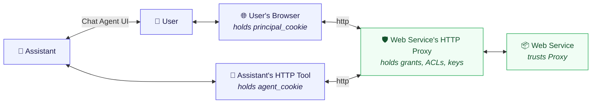

# Reverse Proxy Specification

**Editor:** Aaron Goldman  
**Repository:** https://github.com/AaronGoldman/delegations  

## Abstract

This document specifies the architecture and implementation details for the **Delegation Reverse Proxy**, which acts as the core gateway for ambient authentication and fine-grained authorization. The reverse proxy sits in front of protected web APIs, intercepts unauthorized requests, manages the active permission database, executes the grant matching algorithm, and exposes self-service registration interfaces.

---

## 1. Thesis: Ambient Authentication & Separation of Concerns

The architecture implements ambient authentication across the delegation chain. Secrets are held only by the components responsible for their transport, removing authentication complexity from both the end-user agent code and the destination application services.

### 1.1 The Six-Actor Call Chain

Every API invocation traverses six distinct actors across the network boundary:



* **Ambient Auth:**
  * The **Principal** (User) receives ambient auth from the browser's cookies.
  * The **Agent** (Assistant) receives ambient auth from its HTTP tool's cookie jar.
  * The **Web Service** receives ambient auth by verifying the proxy's signature and trust relationship.

---

## 2. Database Schema

The reverse proxy maintains two core tables in its datastore to authorize and map delegated capabilities.

### 2.1 The `delegation` (Grants) Table
Stores runtime access decisions approved by grantors (principals) to grantees (agents).

```sql
CREATE TABLE delegation (
    delegation_id  UUID        PRIMARY KEY DEFAULT gen_random_uuid(),
    
    -- Identity
    grantor_id     UUID        NOT NULL,             -- Derived UUIDv5(secret, grantor_cookie) ["principal" role]
    grantee_id     UUID        NOT NULL,             -- Derived UUIDv5(secret, grantee_cookie) ["agent" role]
    session_id     UUID        NOT NULL,             -- Derived UUIDv5(secret, session_cookie)
    
    -- Matching fields
    host_pattern   VARCHAR(255) NOT NULL,            -- "api.example.com" or "*.example.com"
    path_pattern   VARCHAR(500) NOT NULL,            -- "/users/123/messages" or "/users/*"
    methods        VARCHAR(10)[] NOT NULL,           -- e.g. ["GET", "POST"]
    scopes         VARCHAR(100)[] NOT NULL,          -- e.g. ["READ_DM", "SEND_DM"]
    
    -- Grant breadth & duration
    breadth        VARCHAR(10) NOT NULL CHECK (breadth IN ('once', 'session', 'agent')),
    ttl            VARCHAR(20) NOT NULL,             -- "4h" | "2d" | "90d" | "400d" | "indefinite"
    
    -- Lifecycle
    granted_at   TIMESTAMPTZ NOT NULL DEFAULT NOW(),
    expires_at   TIMESTAMPTZ,                        -- NULL when ttl = "indefinite"
    last_used_at TIMESTAMPTZ,
    revoked_at   TIMESTAMPTZ,                        -- NULL if active

    -- Index for fast lookups in auth middleware
    CONSTRAINT idx_active_delegations UNIQUE (grantee_id, session_id, delegation_id)
);

CREATE INDEX idx_active_lookup ON delegation (grantee_id)
    WHERE revoked_at IS NULL AND (expires_at IS NULL OR expires_at > NOW());
```

### 2.2 The `will_call` (Claims & Delegation Rules) Table
Defines prerequisite-based scope acquisition. If an entity proves ownership of a prerequisite scope, they may claim the target scope.

```sql
CREATE TABLE will_call (
    rule_id              UUID        PRIMARY KEY DEFAULT gen_random_uuid(),
    prerequisite         VARCHAR(255) NOT NULL,         -- Prerequisite scope required (e.g. "did:key:z6Mk...")
    claimable            VARCHAR(255) NOT NULL,         -- Scope allowed to be claimed (e.g. "urn:contoso:corpuser:alice")
    
    -- Scope delegation authority constraints (optional)
    prerequisite_domain  VARCHAR(255),
    prerequisite_path    VARCHAR(500),
    claimable_domain     VARCHAR(255),
    claimable_path       VARCHAR(500),
    
    created_by           VARCHAR(255) NOT NULL,         -- PrincipalID of creator (must hold claimable scope)
    breadth              VARCHAR(10) NOT NULL CHECK (breadth IN ('once', 'permanent')),
    created_at           TIMESTAMPTZ NOT NULL DEFAULT NOW(),
    expires_at           TIMESTAMPTZ,                  -- NULL means never
    claimed_at           TIMESTAMPTZ                   -- Set when a 'once' rule is consumed
);

CREATE INDEX idx_will_call_prereq ON will_call (prerequisite) WHERE claimed_at IS NULL;
```

---

## 3. Authorization and Scope Verification Logic

When an incoming HTTP request is intercepted by the reverse proxy with an `agent_cookie` and `session_cookie`:

### 3.1 Identity Derivation
The proxy derives the `agent_id` (grantee_id) and `session_id` using the server's private secret and the cookies (see [Delegation Formats Proposal](delegation-formats-proposal.md) for derivation formulas).

### 3.2 Fetch and Match Algorithm
1. **Query active delegations:**
   ```sql
   SELECT delegation_id, host_pattern, path_pattern, methods, scopes, breadth
   FROM delegation
   WHERE grantee_id = $derived_agent_id
     AND revoked_at IS NULL
     AND (expires_at IS NULL OR expires_at > NOW());
   ```
2. **Apply filters to each delegation:**
   * **Session Match:** If `breadth != 'agent'`, the delegation's `session_id` MUST match the request's derived `session_id`. If `breadth == 'agent'`, session validation is skipped.
   * **Host Match:** The request's host must match `host_pattern` (exact match or subdomain wildcard like `*.example.com`).
   * **Path Match:** The request's path must match `path_pattern` (exact match or path-prefix wildcard like `/users/*`).
   * **Method Match:** The request's HTTP method must be in the `methods` array.
   * **Scope Match:** The delegation's `scopes` must contain the endpoint's required scopes (superset check).

3. **Actions on Success:**
   * Allow the request to pass.
   * Update `last_used_at = NOW()` on the matching delegation.
   * If `breadth == 'once'`, set `revoked_at = NOW()` immediately after use to prevent replay.

---

## 4. Scope Authorizer Logic (Transitive Delegation)

To approve a delegation request from another agent at `/delegate/grant`, the proxy must verify that the approving principal (grantor) is authorized to delegate that scope.

A grantor holds a scope $S$ if:
1. $S$ matches an entry in the `principal_scope` table (directly pre-assigned to them), OR
2. $S$ matches a delegation where they are the `grantee_id`.

### Scope Specificity (Rule 1)
If an entity holds a scope, they may delegate a *more specific* scope for the same resource, but not a broader or different one.
* **Allowed:** Delegate `urn:username:alice` on `api.example.com/users/*` if they hold `urn:username:alice` on `*.example.com/*`.
* **Denied:** Delegate `urn:username:alice` on `other.com` if they only hold it for `example.com`.

### will_call Authority (Rule 2)
If a grantor holds the `prerequisite` of a `will_call` rule, they are permitted to delegate the corresponding `claimable` scope.
* Allows seamless multi-device onboarding where an authenticated browser device registers another agent's public keys.

---

## 5. Self-Service Registration Endpoints

The reverse proxy exposes self-service endpoints to allow agents and users to claim identities and register capabilities programmatically.

### 5.1 Portable `did:key` Registration (`POST /delegations/scopes`)
An entity can generate a local cryptographic key pair, derive a `did:key` identifier, and present a self-signed JWT to claim that identity scope.

* **Flow:**
  1. Agent presents a self-signed JWT claiming ownership of `did:key:z6Mk...`.
  2. Proxy verifies the signature against the JWT's embedded public key.
  3. Proxy inserts `did:key:z6Mk...` as a principal scope for the `agent_id`.
  4. Proxy checks the `will_call` table. If a rule exists with `prerequisite = 'did:key:z6Mk...'`, it executes the rule and automatically grants the `claimable` scope (e.g. `urn:contoso:user:alice`).

### 5.2 Self-Service Registration Endpoints (Planned)
* **Register Username (`POST /delegations/register/username`):** Exposes a secure interface for an authenticated principal to claim a stable user URN mapping.
* **Register Email Scope (`POST /delegations/register/email`):** Allows claiming an verified email scope using single-use verification links.

---

## 6. Lifecycle and Garbage Collection

To prevent unbounded database growth and maintain security hygiene, the reverse proxy enforces an inactivity-based pruning system:

* **Inactivity Expiration:** Any delegation, **including** those marked as `ttl = "indefinite"`, is deemed expired if it has not been successfully used to authorize an API call in the last **400 days**.
* **Pruning Script:**
  ```sql
  DELETE FROM delegation
  WHERE last_used_at < NOW() - INTERVAL '400 days'
     OR (last_used_at IS NULL AND granted_at < NOW() - INTERVAL '400 days');
  ```

---

## 7. Upstream Propagation (X-Delegation Header)

Once the reverse proxy validates an incoming client request against active delegations, it forwards the request to the upstream target web service. 

To propagate this validated identity statelessly, the proxy strips the sensitive client cookies and injects an Ed25519-signed JWT token. This token may be passed in the `Authorization: Bearer` header or in the specialized `X-Delegation` header.

For details on the signature verification, public key distribution, and payload schema, refer to the [Delegation Bearer Token Specification](x-delegation-header.md).
