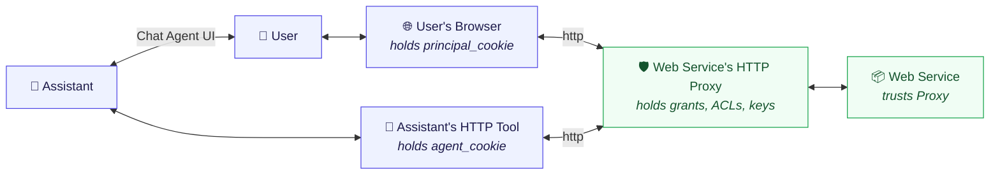

# Scope Granting Flows

**Editor:** Aaron Goldman

## Overview

Every scope grant ultimately answers: *who proves what, to whom, using which credential?*

**Principal** and **agent** are roles taken in a single grant transaction, not types of entity.
The same cookie-identified entity can be the agent (grantee) in one grant and the principal
(grantor) in the next. Any entity that holds a scope may delegate that scope to another entity.

There are three kinds of scope that entities accumulate:

| Kind | Example | Proven how |
|---|---|---|
| **did:key** | `did:key:z6Mk…` | Self-signed JWT (you hold the private key) |
| **User URN** | `urn:contoso:corpuser:aagoldma` | Claimed via a will_call rule |
| **Group URN** | `urn:contoso:group:code_access` | Claimed via a will_call rule |

### The six-actor call chain

Every request flows through six distinct actors. The first four (left of the network
boundary) are the *principal side*; the last two are the *service side*. Each arrow
crosses an authentication boundary that the delegation system must secure.



Each actor stores only the secret appropriate to its role: the user remembers a seed
phrase, the browser holds the principal cookie, the HTTP tool holds the agent cookie,
and the proxy holds the grants table and signing keys. The assistant and the web
service themselves hold no auth state — they receive ambient identity from the actor
calling them.

---

## The Credential Chain

```
HR system (holds urn:contoso:user:*)
  │
  └─► will_call: did:key:zAlice → urn:contoso:user:alice
          │
          └─► Alice (now holds urn:contoso:user:alice) acts as grantor:
                  │
                  ├─► grants urn:contoso:user:alice to her laptop agent
                  │       └─► laptop agent acts as grantor:
                  │               └─► grants urn:contoso:user:alice to a CLI agent
                  │
                  └─► grants urn:contoso:group:code_access to her laptop agent
                          └─► laptop agent accesses /code/*
```

Each arrow is a **Delegation** stored in the proxy. The grantor and grantee are both
cookie-identified entities. There is no structural difference between them — only the
role each plays in that specific grant.

---

## The Two Tables

The proxy stores two distinct kinds of record:

| Table | Row means | Created by | Consumed by |
|---|---|---|---|
| **Delegation** (grant) | grantee UUIDv5 may access host/path/method with scopes | any entity acting as grantor at `/delegations/ask` | auth middleware on every request |
| **will_call** (claims) | if you hold prerequisite, you may delegate claimable | any entity that holds claimable, at `/delegations/scopes/rules` | `/delegations/scopes` POST handler & grant authorization logic |

Grants are runtime access decisions. Will-call rows define both identity claims and scope delegation authority.

In a grant, **principal** = the entity approving (grantor) and **agent** = the entity receiving (grantee). Both are identified by UUIDv5(cookie). A grantee can immediately become a grantor and delegate the same scope onward, subject to the same rule: *you can only delegate what you hold.*

```sql
CREATE TABLE delegation (
    delegation_id  TEXT        PRIMARY KEY,          -- UUIDv4
    grantor_id     TEXT        NOT NULL,             -- UUIDv5(id_secret, grantor_cookie)  ["principal" role]
    grantee_id     TEXT        NOT NULL,             -- UUIDv5(id_secret, grantee_cookie)  ["agent" role]
    session_id     TEXT        NOT NULL,             -- UUIDv5(id_secret, session_cookie)
    host_pattern   TEXT        NOT NULL,             -- "api.example.com" or "*.example.com"
    path_pattern   TEXT        NOT NULL,             -- "/users/*" or exact path
    methods        TEXT        NOT NULL,             -- JSON array e.g. '["GET","POST"]'
    scopes         TEXT        NOT NULL,             -- JSON array e.g. '["profile_view"]'
    breadth        TEXT        NOT NULL              -- 'once' | 'session' | 'agent'
                   CHECK (breadth IN ('once','session','agent')),
    issued_at      TIMESTAMPTZ NOT NULL DEFAULT now(),
    expires_at     TIMESTAMPTZ,                      -- NULL means indefinite
    revoked_at     TIMESTAMPTZ                       -- NULL means active
);
-- A grantee_id in one row can be the grantor_id in another: that is transitive delegation.

CREATE INDEX ON delegation (grantee_id, session_id);  -- hot path: auth middleware lookup
CREATE INDEX ON delegation (grantor_id);              -- list grants page

CREATE TABLE will_call (
    rule_id              TEXT        PRIMARY KEY,      -- UUIDv4
    prerequisite         TEXT        NOT NULL,         -- scope you must hold to delegate
                                                       --   "did:key:z6Mk…"  (prove key ownership)
                                                       --   "urn:contoso:corpuser:alice"  (hold URN)
    claimable            TEXT        NOT NULL,         -- scope you may delegate
                                                       --   "urn:contoso:corpuser:alice"  (identity claim)
                                                       --   "did:key:z2…"  (delegation authority claim)
    -- Delegation authority fields (optional; NULL means applies to all paths):
    prerequisite_domain  TEXT,                         -- host pattern prerequisite applies to
    prerequisite_path    TEXT,                         -- path pattern prerequisite applies to
    claimable_domain     TEXT,                         -- host pattern claimable applies to
    claimable_path       TEXT,                         -- path pattern claimable applies to
    
    created_by           TEXT        NOT NULL,         -- principalID; must hold `claimable` at insert
    breadth              TEXT        NOT NULL          -- 'once' | 'permanent'
                         CHECK (breadth IN ('once','permanent')),
    created_at           TIMESTAMPTZ NOT NULL DEFAULT now(),
    expires_at           TIMESTAMPTZ,                  -- NULL means never expires
    claimed_at           TIMESTAMPTZ                   -- set when a 'once' rule is consumed
);

CREATE INDEX ON will_call (prerequisite);             -- hot path: looked up on every /scopes POST
CREATE INDEX ON will_call (claimable);                -- find delegation authority for requested scope
```

---

## Scope Delegation Rules

When an entity (acting as grantor) attempts to delegate a scope to an agent (grantee), the proxy must verify authorization. There are two rules:

### Rule 1: Scope Specificity

**If you hold a scope, you can delegate a more specific scope for the same resource.**

Example:
```
Entity holds:        urn:username:alice (for *.example.com/*)
Can delegate:        urn:username:alice for (api.example.com/users/*)  [more specific host]
Cannot delegate:     urn:username:alice for (*.other.com/*)            [different domain]
```

### Rule 2: will_call Delegation Authority

**If you hold the `prerequisite` of a will_call row, you can grant the corresponding `claimable` scope.**

Example will_call row (delegation authority claim):
```
prerequisite:         urn:username:alice
prerequisite_domain:  *.example.com
prerequisite_path:    /*
claimable:            did:key:z6Mk…
claimable_domain:     *.example.com
claimable_path:       /*
breadth:              permanent
```

**Meaning:** "Anyone holding `urn:username:alice` (at *.example.com/*) can grant `did:key:z6Mk…` (at *.example.com/*) to another agent."

**Validation logic:**

```sql
-- When entity tries to delegate requested_scope to grantee:

-- Rule 1: Does entity hold requested_scope?
SELECT 1 FROM delegation
WHERE  grantee_id = $entity_id
  AND  scopes CONTAINS $requested_scope
  AND  revoked_at IS NULL
  AND  (expires_at IS NULL OR expires_at > now())
  AND  host_pattern MATCHES $request_host         -- patterns must cover request
  AND  path_pattern MATCHES $request_path
UNION ALL

-- Rule 2: Is there a will_call row that grants this scope?
SELECT 1 FROM will_call
WHERE  claimable = $requested_scope               -- scope being requested
  AND  breadth = 'permanent'                      -- only permanent rules allow re-delegation
  AND  (prerequisite_domain IS NULL OR prerequisite_domain MATCHES $request_host)
  AND  (prerequisite_path IS NULL OR prerequisite_path MATCHES $request_path)
  AND  (expires_at IS NULL OR expires_at > now())
  AND  EXISTS (
    -- Entity must hold the prerequisite scope
    SELECT 1 FROM delegation
    WHERE  grantee_id = $entity_id
      AND  scopes CONTAINS will_call.prerequisite
      AND  host_pattern MATCHES COALESCE(will_call.prerequisite_domain, host_pattern)
      AND  path_pattern MATCHES COALESCE(will_call.prerequisite_path, path_pattern)
      AND  revoked_at IS NULL
      AND  (expires_at IS NULL OR expires_at > now())
  );
```

**Practical example:** Multi-device user login:

```
Device 1 (phone) proves ownership of did:key:z2 (via JWT signature)
  → POST /delegations/scopes → did:key:z2 is claimed
  
Check will_call rules with prerequisite=did:key:z2
  → Found: prerequisite=did:key:z2 → claimable=urn:username:aagoldma (breadth=permanent)
  → Grant urn:username:aagoldma to phone's agent_id

Now phone wants to grant did:key:z2 to Device 2:
  → Check will_call: prerequisite=urn:username:aagoldma, claimable=did:key:z2, breadth=permanent
  → Phone holds urn:username:aagoldma? YES (from above grant)
  → ALLOW: create new delegation granting did:key:z2 to Device 2
  
Device 2 now controls did:key:z2
  → Can log in independently
  → Can register its own did:key and continue re-granting urn:username:aagoldma to other devices
```

---

**Usage patterns expressed as SQL:**

```sql
-- Auth middleware: find a matching active delegation for the requesting entity
SELECT * FROM delegation
WHERE  grantee_id  = $entity_id
  AND  session_id   = $session_id   -- or breadth = 'agent'
  AND  revoked_at   IS NULL
  AND  (expires_at  IS NULL OR expires_at > now());

-- Grant approval UI: does this entity (now acting as grantor) hold the scope?
-- Entity holds scope if it appears in at least one active delegation as grantee,
-- OR if it was added directly to principal_scope (via will_call).
SELECT 1 FROM delegation
WHERE  grantee_id = $grantor_entity_id
  AND  $scope = ANY(scopes)         -- or JSON contains check
  AND  revoked_at IS NULL
  AND  (expires_at IS NULL OR expires_at > now())
UNION ALL
SELECT 1 FROM principal_scope
WHERE  principal_id = $grantor_entity_id
  AND  scope = $scope
LIMIT 1;

-- /delegations/scopes POST: find rules triggered by a newly registered scope
SELECT * FROM will_call
WHERE  prerequisite = $did_key_or_urn
  AND  claimed_at   IS NULL
  AND  (expires_at  IS NULL OR expires_at > now());

-- Consume a once rule atomically
UPDATE will_call
SET    claimed_at = now()
WHERE  rule_id    = $rule_id
  AND  claimed_at IS NULL         -- guard against double-claim race
RETURNING *;

-- Add a user to a group: insert a permanent rule
-- "any principal holding urn:contoso:corpuser:alice can claim group:code_access"
INSERT INTO will_call (rule_id, prerequisite, claimable, created_by, breadth)
VALUES ($uuid, 'urn:contoso:corpuser:alice', 'urn:contoso:group:code_access', $bob_principal_id, 'permanent');
```

---

## How Entities Get IDs and Scopes

### Step 1 — Cookies → IDs

Any browser or HTTP client that hits any `/delegations/` endpoint will have
`agent_cookie` and `session_cookie` set automatically by the proxy. The proxy
derives stable, opaque IDs from these cookies:

```
agent_id   = UUIDv5(id_secret, agent_cookie)    -- stable across sessions
session_id = UUIDv5(id_secret, session_cookie)  -- rotates with each session
```

The entity now has an identity. It holds no scopes yet.

### Step 2 — Acquiring scopes

There are five paths from "has an ID" to "holds scopes":

| Path | Mechanism | Example |
|---|---|---|
| **1. Delegation URL** | Another entity generates a delegation request JWT and sends a link; the grantor visits `/delegations/ask` and approves | Agent emails a link to alice; alice clicks Approve |
| **2. Self-service** | Entity proves ownership of a key it generated itself; no prior arrangement needed | Enter seed → derive did:key → self-signed JWT → claim `did:key` scope |
| **3. Will-call** | Someone else created a will_call rule naming a prerequisite you hold; you POST to `/delegations/scopes` and the rule fires automatically | HR left a rule: `did:key:zAlice → urn:contoso:user:alice`; alice posts her JWT and collects both |
| **4. SSO / external IdP claim** | Entity hits a claim endpoint backed by an SSO provider; on successful login the proxy adds the IdP-asserted URN scopes | Hit `/delegations/scopes/sso` → OAuth/OIDC → proxy maps identity to `urn:contoso:user:alice` |
| **5. Hydration at request time** | Proxy enriches the scope set on every request from a live source (LDAP, group service) without the entity explicitly claiming anything | Request arrives with `urn:contoso:user:alice`; proxy looks up LDAP and adds `urn:contoso:group:*` memberships before forwarding |

Paths 1–4 are **pull** (entity takes action). Path 5 is **push** (proxy injects at request time).
Paths 1–4 are stored in the `delegation` or `principal_scope` tables. Path 5 is ephemeral —
it enriches the forwarded request but is not persisted.

**Self-service vs. will-call:** In self-service (path 2) the entity generates the credential and claims it unilaterally — no prerequisite will_call rule exists, only a self-signed proof. In will-call (path 3) an admin or peer pre-registered a will_call rule; the entity "picks up" the waiting scope by satisfying the prerequisite. Both happen at the same endpoint (`POST /delegations/scopes`) but differ in who initiated the arrangement.

---

## will_call

```
will_call {
    rule_id:          uuid
    prerequisite:     string   // scope you must already hold or prove
                               // e.g. "did:key:z6Mk…" or "urn:contoso:group:hrAdmin"
    claimable:        string   // scope you may add to your principal
                               // e.g. "urn:contoso:corpuser:alice"
    created_by:       string   // principalID of whoever created this rule
                               // must hold `claimable` at creation time
    breadth:          string   // "once" (rule deleted after first use)
                               // "permanent" (reusable, e.g. group membership)
    expires_at:       string   // optional RFC 3339
}
```

### How `/delegations/scopes` POST uses it — self-service vs. will-call

**Self-service** (no prerequisite rule needed — entity proves it owns the key):

```
POST /delegations/scopes
  body: jwt=<self-signed JWT proving control of did:key:z…>

Proxy:
  1. Verify JWT signature → extract did:key
  2. ScopeStore.AddPrincipalScope(entityID, did:key)    ← scope claimed by self-service
  3. Check for any will-call rules (see below)
  4. Redirect to /delegations/scopes
```

**Will-call** (fires automatically after step 2 above, or when entity already holds prerequisite URN):

```
Proxy (continuing from step 3, or triggered by a URN claim):
  3. SELECT * FROM scope_claim_rule
     WHERE prerequisite = $newly_claimed_scope
       AND claimed_at IS NULL
       AND (expires_at IS NULL OR expires_at > now())
  4. For each matching rule:
       ScopeStore.AddPrincipalScope(entityID, rule.claimable)
       if rule.breadth == 'once':
         UPDATE will_call SET claimed_at = now() WHERE rule_id = $rule_id
           AND claimed_at IS NULL   ← atomic guard against double-claim
```

The same POST that registers a `did:key` (self-service) automatically picks up any waiting will-call rules keyed to that `did:key`. Alice never needs to take a separate step.

### Who creates will_call rules

Creation requires holding the `claimable` scope. The rule is stored by an admin endpoint (e.g. `POST /delegations/scopes/rules`) which:
1. Reads the creator's principalID from their principal cookie
2. Checks `ScopeStore.GetPrincipalScopes(principalID)` contains `claimable`
3. Stores the rule

This enforces: *you can only create a rule to grant what you already hold.*

---

## Flow 1 — Self-Service did:key Registration (Implemented)

**Goal:** An entity proves it controls a keypair and registers the `did:key` scope against its agent ID.

```
Entity's browser                        Proxy
        │                                 │
        │  GET /delegations/scopes         │
        │─────────────────────────────────►│  set agent_cookie + session_cookie if absent
        │◄─────────────────────────────────│  (agent_id = UUIDv5(agent_cookie))
        │                                 │
        │  (type seed phrase in browser)   │
        │  JS: SHA-256(seed) → privKey     │
        │      derive pubKey, did:key      │
        │      sign JWT{host:*, path:*, scopes:[did:key], iat}
        │                                 │
        │  POST /delegations/scopes        │
        │  body: jwt=<self-signed JWT>     │
        │─────────────────────────────────►│  ParseDIDKey from JWT payload
        │                                 │  ed25519.Verify(pubKey, jwt)
        │                                 │  check iat within 5 min window
        │                                 │  ScopeStore.AddPrincipalScope(agentID, did:key)
        │                                 │  apply any matching will_call rules
        │◄─────────────────────────────────│  303 redirect
```

**Properties:**
- No admin involvement
- did:key is portable: same seed → same key on any device
- The browser cookie is the device identity; the did:key is the human identity
- Seed stored in browser password manager; recoverable on new device

---

## Flow 2 — Onboarding a New Hire (User URN)

**Goal:** HR admin grants `urn:contoso:corpuser:alice` to alice's did:key via a will_call rule, which alice redeems by entering her seed.

### Step A — Admin creates a one-time will_call rule

```
HR admin (holds urn:contoso:user:*)       Proxy
        │                                   │
        │  1. Generate random seed           │
        │     derive did:key from seed       │
        │                                   │
        │  POST /delegations/scopes/rules    │
        │  {                                 │
        │    prerequisite: "did:key:z6Mk…",  │
        │    claimable:    "urn:contoso:user:alice",
        │    breadth:      "once",           │
        │    expires_at:   "+24h"            │
        │  }                                 │
        │───────────────────────────────────►│
        │                                   │  check: does HR hold a scope that
        │                                   │  covers "urn:contoso:user:alice"?
        │                                   │  urn:contoso:user:* ⊇ urn:contoso:user:alice ✓
        │                                   │  INSERT will_call
        │◄───────────────────────────────────│
        │                                   │
        │  2. Email alice: seed + URL        │
        │     https://proxy/delegations/scopes#<seed>
```

### Step B — Alice redeems in one page visit

```
Alice's browser                           Proxy
        │                                   │
        │  GET /delegations/scopes           │
        │  (JS reads seed from URL fragment, │
        │   clears fragment, fills input,    │
        │   auto-submits)                    │
        │                                   │
        │  POST /delegations/scopes          │
        │  body: jwt=<self-signed by did:key>│
        │───────────────────────────────────►│
        │                                   │  1. verify JWT → extract did:key
        │                                   │  2. AddPrincipalScope(principal, did:key)
        │                                   │  3. SELECT * FROM will_call
        │                                   │     WHERE prerequisite = did:key
        │                                   │     → finds rule: claimable = urn:contoso:user:alice
        │                                   │  4. AddPrincipalScope(principal, urn:contoso:user:alice)
        │                                   │  5. UPDATE will_call SET claimed_at = now()
        │◄───────────────────────────────────│  303 redirect
```

Alice now holds both `did:key:z6Mk…` and `urn:contoso:user:alice` in a single POST. No second step.

### ⚠ Wildcard scope authorization

The rule creation check — *does the creator hold `claimable`?* — must use the same wildcard matching as the delegation middleware, not an exact string comparison:

```sql
-- At rule creation: does HR hold a scope covering claimable?
-- Pseudocode: any scope in HR's set that matchPattern(scope, claimable)
SELECT 1 FROM principal_scope
WHERE principal_id = $hr_principal_id
  AND (scope = $claimable                           -- exact match
       OR ($claimable LIKE replace(scope,'*','%')   -- wildcard: urn:contoso:user:* covers urn:contoso:user:alice
           AND scope LIKE '%*'))                    -- only apply to scopes that contain *
LIMIT 1;
```

Without this, HR holding `urn:contoso:user:*` could not create rules for any specific user URN.

---

## Flow 3 — New Device for an Existing User

**Goal:** Alice already has `urn:contoso:corpuser:alice` on Device A. She wants to add Device B.

### Option A — Self-service via did:key (preferred)

```
Device B browser
        │
        │  1. Enter same seed → same did:key (already registered against alice's user URN)
        │  2. POST /delegations/scopes with self-signed JWT  → did:key registered on Device B
        │  3. Proxy sees did:key scope → alice's user URN is already linked
        │     (ScopeAuthorizer: did:key ∈ alice's scopes → authorize urn:contoso:corpuser:alice)
        │  4. Device B now has the user URN scope
```

This is the clean path. The seed is the "password" that ties all devices together.

### Option B — Click-OK on an already-authenticated device

```
Device A (authenticated)                Device B (new)
        │                                     │
        │                                     │  GET /delegations/ask?token=<JWT requesting
        │◄──────────────────────────────────── │  urn:contoso:corpuser:alice for Device B agent>
        │  Alice sees approval UI              │
        │  Clicks Approve                      │
        │─────────────────────────────────────►│  Device B now has user URN scope
```

Standard delegation flow. Device B generates a delegation request token; alice approves it on Device A.

### Option C — Admin link (fallback, same as onboarding Flow 2)

Used when alice has no authenticated devices and has lost her seed.

---

## Flow 4 — Group Membership Grant

**Goal:** Bob (holds `urn:contoso:group:code_access`) grants alice membership so her agent can access `/code/*`.

Bob acts as grantor. He visits `/delegations/ask` with a delegation request token that alice's agent generated. Bob approves it. The proxy stores a delegation row:

```
grantor_id:  UUIDv5(bob's cookie)
grantee_id:  UUIDv5(alice's agent cookie)
scopes:      ["urn:contoso:group:code_access"]
host_pattern: "proxy.contoso.com"
path_pattern: "/code/*"
methods:      ["GET"]
breadth:      "agent"
```

ScopeAuthorizer check at approval time: `canDelegate(bob, "urn:contoso:group:code_access")` → bob holds it ✓

Alternatively, Bob creates a permanent will_call rule:

```sql
INSERT INTO will_call (rule_id, prerequisite, claimable, created_by, breadth)
VALUES ($uuid, 'urn:contoso:user:alice', 'urn:contoso:group:code_access', $bob_id, 'permanent');
```

This means any future device alice authenticates on will automatically receive the group scope when she claims her user URN — no further action from Bob required.

---

## Scope Authorizer Logic (Proposed)

The `ScopeAuthorizer` answers: *can this entity (acting as grantor) delegate scope S?*

The entity holds scope S if:
- S appears in `principal_scope` for this entity (claimed via will_call), **or**
- S appears in an active `delegation` row where this entity is the `grantee_id`

Wildcard scopes (`urn:contoso:user:*`) cover any specific URN they match.

```
canDelegate(entityID, scope) bool:
  if scope ∈ principalScopes(entityID):           return true   // claimed identity scope
  if scope ∈ grantedScopes(entityID):             return true   // received via delegation
  if wildcardMatch(principalScopes(entityID), scope): return true
  if wildcardMatch(grantedScopes(entityID), scope):   return true
  return false
```

This single rule applies uniformly whether the grantor is a human browser, a CLI agent, or a sub-agent. There are no special cases for entity type.

---

## Open Questions

1. **Scope persistence:** `InMemoryPrincipalScopeStore` is lost on restart. For URN scopes and will_call rules, both stores need to be durable (database-backed).

2. **Group ownership model:** Who can create a will_call rule for a group URN? Anyone who holds the group URN scope, per the "you can only grant what you hold" rule. No special owner designation needed.

3. **AgentID is always UUIDv5 of cookie.** The did:key never becomes an agent_id. It is only ever a *scope string* registered against a principalID. The ask/grant flow continues to use cookie-derived UUIDs as agent_ids. This keeps the two flows cleanly separated.


--- 

## what where
when you interact with an AI asistant we have a few componets.
1) the user-agent aka editor
  * chat box
  * folder browser
  * editor buffers
  * terminal
2) Local inference
  * small fast LLMs on the local GPU
3) Local tool calls
  * read the local files
  * write the local files
  * http from the local box
4) Remote tool calls
  * value add tools
5) Remote inference
  * large slow LLM on the cloud
  * deep expert skills